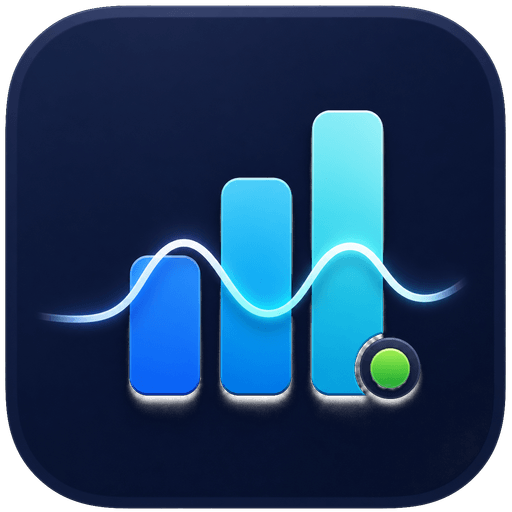
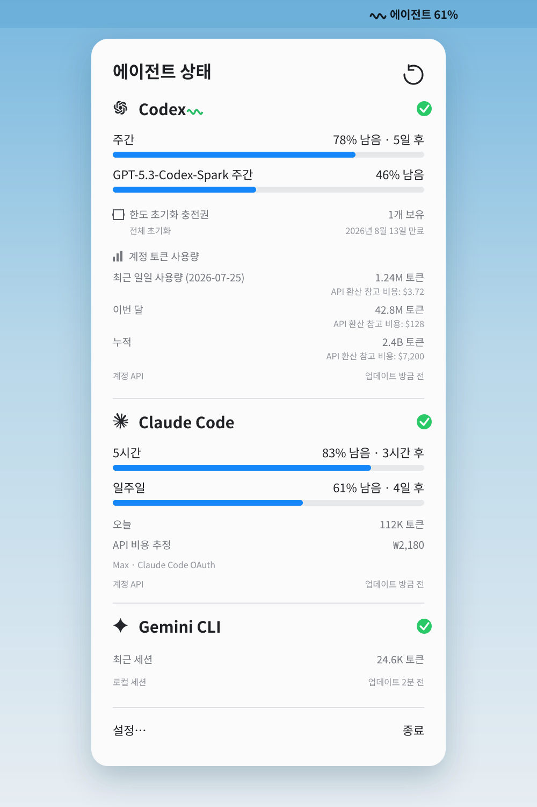

# Tokeni Bar

**한국어** | [English](README.en.md)

[](https://github.com/90ms/tokeni-bar/actions/workflows/ci.yml)
[](https://github.com/90ms/tokeni-bar/releases/latest)
[](LICENSE)



AI 코딩 에이전트의 토큰 상태를 확인하고, 작업 시간만큼 픽셀 동반자 ByteBot을
키우는 개인정보 보호 중심의 macOS 메뉴바 앱입니다.

<p align="center">
  
</p>

<p align="center">
  
</p>

> 사용량 영역의 샘플 이미지이며 실제 계정정보는 포함하지 않습니다.

Tokeni Bar는 기존 CLI 로그인을 재사용합니다. 프롬프트, 응답, 액세스 토큰,
리프레시 토큰 또는 쿠키를 저장하지 않습니다. 쿼터 비율은 항상 **남은 비율**이며,
비용은 구독 청구액이 아닌 참고값입니다.

## 주요 기능

- 에이전트가 활동한 분만큼 성장하는 오리지널 픽셀 동반자 **ByteBot**
- 알 → 부화 → 아기 → 성체로 이어지는 성장과 작업·경고·축하·수면 애니메이션
- Codex와 Claude의 쿼터, 초기화 시각 및 계정 상태 표시
- 확인 가능한 계정 활동과 로컬 토큰·비용 기록 통합
- 메뉴바에 가장 낮은 잔여량, 선택 제공자 또는 월 예상 비용 표시
- 프롬프트나 응답을 읽지 않고 파일 변경 시각으로 로컬 세션 활동 감지
- 24시간, 7일 및 30일 집계 기록을 로컬에 보관
- 제공자별 잔여량 및 월 예산 알림
- 한국어·영어, 달러·원화, 컴팩트 모드 및 로그인 시 실행 지원

## ByteBot 성장 방식

- 하나 이상의 에이전트가 활동한 1분마다 1 XP를 얻습니다.
- 여러 제공자가 동시에 활동해도 같은 분에는 1 XP만 얻으며, 하루 최대치는
  90 XP입니다.
- 앱이 종료된 시간은 소급 계산하지 않고 토큰 소비량이나 쿼터 소진량으로
  보상하지 않습니다.
- 누적 15 XP에 부화하고, 120 XP에 아기, 360 XP에 성체가 됩니다.
- **토닥하기**는 XP를 추가하지 않고 잠시 축하 동작만 보여줍니다.
- 쿼터 경고, 작업 중, 장시간 비활동 상태에 따라 ByteBot의 반응이 바뀝니다.

**설정 → Tokeni**에서 ByteBot과 애니메이션을 각각 끌 수 있습니다. 메뉴바
표시 방식을 **ByteBot 상태**로 선택할 수도 있습니다. macOS의 동작 줄이기나
저전력 모드에서는 애니메이션이 자동으로 멈춥니다.

## 설치

### 요구 사항

- macOS 14 Sonoma 이상
- Apple Silicon
- Codex, Claude Code, Grok, Gemini CLI 또는 OpenCode 중 하나 이상 설치 및 로그인

### Homebrew

```bash
brew install --cask 90ms/tap/tokeni-bar
open -a "Tokeni Bar"
```

완전한 이름으로 설치하면 `90ms/tap` 저장소가 자동으로 추가됩니다. Tap 신뢰가
필요한 Homebrew 버전에서는 전체 저장소가 아니라 이 Cask만 신뢰합니다.

### 직접 다운로드

[최신 GitHub Release](https://github.com/90ms/tokeni-bar/releases/latest)에서
ZIP을 내려받아 압축을 풀고 `Tokeni Bar.app`을 `/Applications`로 옮깁니다.

Developer ID 서명을 구성하기 전까지 릴리스는 ad-hoc 서명을 사용합니다. macOS가
첫 실행을 차단하면 **시스템 설정 → 개인정보 보호 및 보안**에서 앱 실행을
허용하세요. Gatekeeper를 전체적으로 비활성화할 필요는 없습니다.

## 첫 실행

1. 모니터링할 CLI를 터미널에서 한 번 실행해 로그인합니다.
2. Tokeni Bar를 열고 메뉴바 오른쪽의 차트 아이콘을 선택합니다.
3. **설정 → 일반**에서 사용할 제공자를 켜고 메뉴바 표시 방식을 선택합니다.
4. **설정 → Tokeni**에서 ByteBot의 현재 단계와 오늘 얻은 XP를 확인합니다.
5. Claude Code 계정 쿼터를 사용하려면 **제공자 연결**에서 **연결**을 선택하고
   키체인 요청을 승인합니다.

설치되지 않았거나 로그인되지 않은 제공자, 현재 CLI 형식에서 지원하지 않는
제공자는 임의의 값을 표시하지 않고 사용 불가 상태로 남습니다.

## 업데이트와 제거

```bash
# 업데이트
brew update
brew upgrade --cask tokeni-bar

# 설정과 기록을 남기고 앱만 제거
brew uninstall --cask tokeni-bar

# 앱, 설정 및 로컬 집계 기록을 모두 제거
brew uninstall --cask --zap tokeni-bar
```

앱은 6시간마다 GitHub Releases에서 새 안정 버전을 확인하고 링크를 표시합니다.
Homebrew 설치본의 다운로드와 설치는 Homebrew가 담당합니다.

## 제공자 지원

| 제공자 | 계정 쿼터 | 토큰 및 비용 데이터 |
|---|---|---|
| Codex | 주간·모델별 한도와 사용 가능한 한도 초기화 충전권 | 실험적인 Codex app-server에서 가져온 최근 일일·이번 달·누적 계정 토큰과 거친 API 환산 참고값 |
| Claude Code | 5시간, 주간 및 모델별 한도 | 중복 제거된 로컬 일일 토큰과 캐시 유형을 반영한 추정 |
| Grok | 현재 미지원 | 현재 로컬 세션 컨텍스트, 비용 추정 미지원 |
| Gemini CLI | 현재 미지원 | 최근 로컬 세션 토큰, 비용 추정 미지원 |
| OpenCode | 현재 미지원 | 로컬 집계 토큰과 기록된 비용 |

Codex·Claude 계정 엔드포인트와 로컬 CLI 파일 형식은 공개 호환성 규격이 아니므로
변경될 수 있습니다. 검증된 데이터를 가져오지 못하면 값을 만들지 않고 오래된
상태나 사용 불가 상태를 표시합니다.

Codex 버킷, Claude 메뉴바 쿼터 및 비용 추정 방식은
[사용량 표시 안내](docs/usage.ko.md)를 참고하세요.

## 개인정보 보호

- 프롬프트와 모델 응답을 표시하거나 보관하지 않습니다.
- 인증 토큰, 리프레시 토큰 및 쿠키를 로그나 앱 저장소에 기록하지 않습니다.
- 명시적인 승인으로 가져온 Claude 인증정보는 만료되거나 앱이 종료될 때까지만
  메모리에 유지합니다.
- 활동 감지는 프롬프트나 응답이 아닌 파일 메타데이터만 읽습니다.
- 기록에는 집계 비율, 토큰 합계 및 예상 비용만 포함하며 30일 동안 보관합니다.
- ByteBot 상태에는 XP, 성장 시각 및 토닥하기 시각만 저장하며 제공자 이름,
  토큰 합계 또는 콘텐츠를 넣지 않습니다.
- 복사 가능한 진단 정보에서 인증정보, 제공자 상세 내용 및 파일 경로를 제외합니다.
- 분석 도구나 텔레메트리를 사용하지 않습니다.

## 문제 해결

### 제공자가 사용 불가로 표시됨

해당 CLI를 한 번 실행하고 설치 및 로그인 상태를 확인하세요. 사용하지 않는
제공자는 **설정 → 일반**에서 끌 수 있습니다.

Claude Code의 OAuth 인증정보가 macOS 키체인에 있으면 사용자가 직접 **연결**을
선택해야 할 수 있습니다. 백그라운드 갱신은 키체인 승인 창을 열지 않습니다.

### 앱은 실행 중이지만 창이 보이지 않음

Tokeni Bar는 Dock이 아닌 메뉴바에서 동작합니다. macOS 메뉴바 오른쪽의
차트 아이콘을 확인하세요.

### Homebrew에서 신뢰하지 않는 tap 오류가 발생함

위의 완전한 이름으로 설치하세요. 이미 추가한 tap의 Cask만 직접 신뢰하려면:

```bash
brew trust --cask 90ms/tap/tokeni-bar
brew install --cask tokeni-bar
```

### 비용이 구독 청구액과 다름

비용은 각 제공자가 제공하는 토큰 상세 정보와 공개 API 단가로 계산한 거친
API 환산 참고값입니다. API 청구서나 Codex, ChatGPT, Claude 또는 Grok 구독
청구액이 아닙니다.

## 소스에서 빌드

```bash
git clone https://github.com/90ms/tokeni-bar.git
cd tokeni-bar
./Scripts/test.sh
swift build
./Scripts/package_app.sh
open "dist/Tokeni Bar.app"
```

`Scripts/package_app.sh`는 기본적으로 ad-hoc 서명을 사용합니다. 다른 로컬 서명
인증서를 사용하려면 `APP_SIGN_IDENTITY`를 설정하세요.

ByteBot 시트를 다시 만들 때만 `ffmpeg`가 필요합니다. 검수된 원본에서
512×384 RGBA 시트를 재생성하려면 다음을 실행합니다.

```bash
./Scripts/generate_bytebot_assets.sh
```

에셋 규격과 라이선스는
[`Sources/TokeniBar/CompanionAssets/bytebot`](Sources/TokeniBar/CompanionAssets/bytebot)을
참고하세요.

## 기존 설치에서 변경된 점

앱의 번들 식별자는 설정과 로그인 항목 호환성을 위해 유지합니다. 기존
`~/Library/Application Support/AgentsStatusBar` 데이터는 첫 실행 시
`~/Library/Application Support/TokeniBar`로 자동 이동하며, 이동할 수 없으면
기존 경로를 안전하게 계속 사용합니다.

배포 관리 방법은 [Homebrew 배포 가이드](docs/HOMEBREW.ko.md), 기여 규칙은
[AGENTS.md](AGENTS.md)를 참고하세요.

## 라이선스

[MIT](LICENSE)
